<!--do doc --readme-examples-->
### `animation`


Source: [animation.rs](./animation.rs)

```console
cargo do run animation
```

Demonstrates animation, easing functions.

### `border`


Source: [border.rs](./border.rs)

```console
cargo do run border
```

Demonstrates borders, corner radius, multiple borders per widget and clip-to-bounds.

### `button`

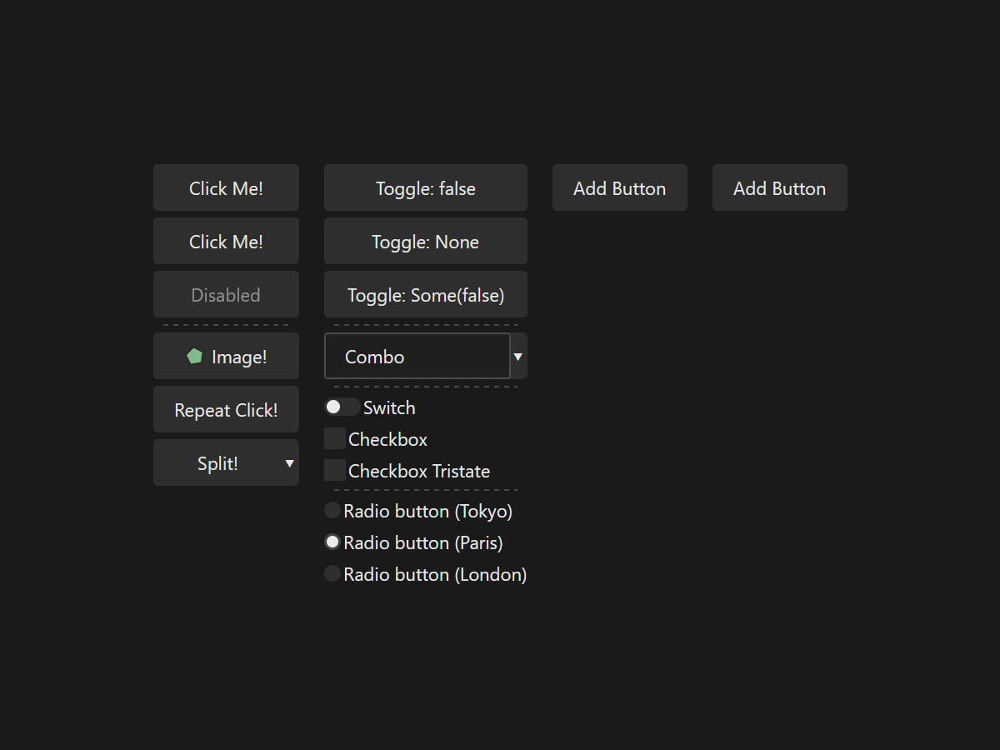

Source: [button.rs](./button.rs)

```console
cargo do run button
```

Demonstrates the button and toggle widgets.

### `calculator`

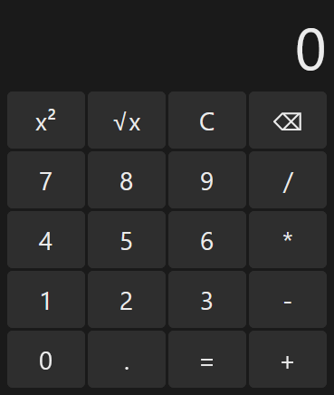

Source: [calculator.rs](./calculator.rs)

```console
cargo do run calculator
```

Simple calculator, demonstrates Grid layout, data context.

### `config`


Source: [config.rs](./config.rs)

```console
cargo do run config
```

Demonstrates the CONFIG service, live updating config between processes.

### `countdown`

Source: [countdown.rs](./countdown.rs)

```console
cargo do run countdown
```

Demonstrates the TIMERS service, variable mapping.

### `cursor`

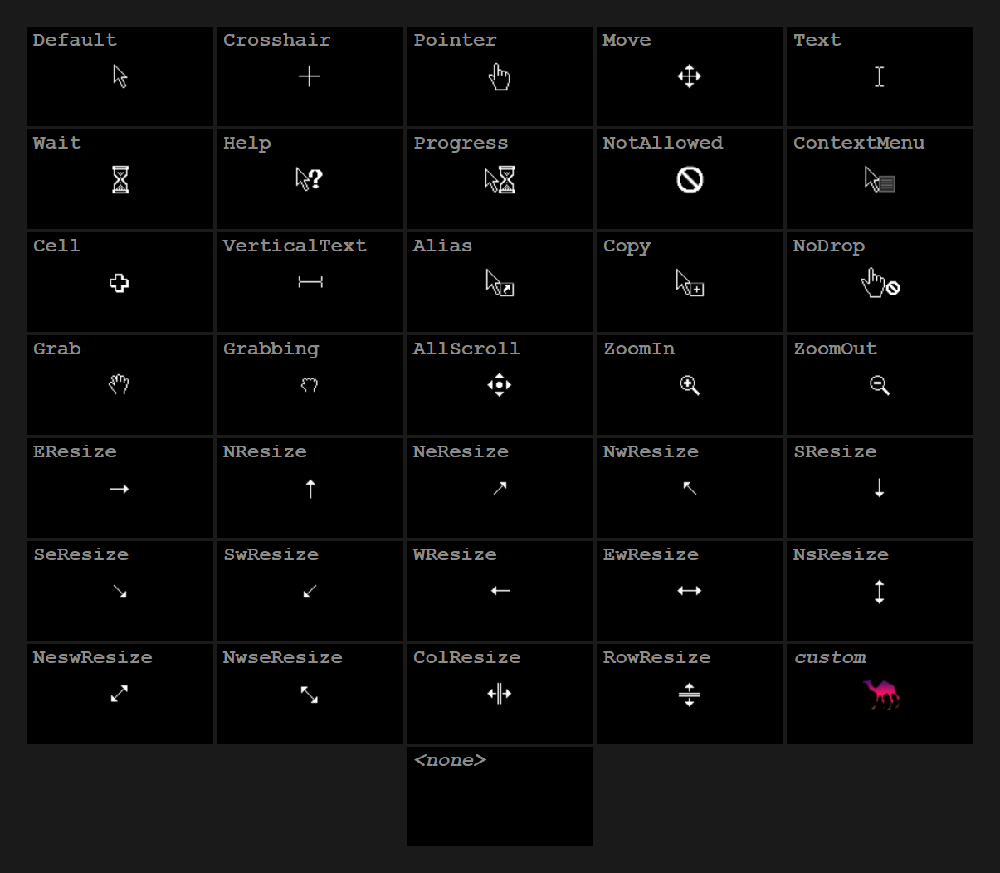

Source: [cursor.rs](./cursor.rs)

```console
cargo do run cursor
```

Demonstrates each `CursorIcon`, tooltip anchored to cursor.

### `extend_view`

Source: [extend_view.rs](./extend_view.rs)

```console
cargo do run extend_view
```

Demonstrates the `zng-view` extension API and render extensions API.

### `focus`


Source: [focus.rs](./focus.rs)

```console
cargo do run focus
```

Demonstrates the focus service, logical and directional navigation.

### `gradient`


Source: [gradient.rs](./gradient.rs)

```console
cargo do run gradient
```

Demonstrates gradient rendering.

### `headless`


Source: [headless.rs](./headless.rs)

```console
cargo do run headless
```

Demonstrates headless apps, image and video rendering.

### `hot_reload`


Source: [hot_reload.rs](./hot_reload.rs)

```console
cargo do run hot_reload
```

Demonstrates the `"hot_reload"` feature.

### `icon`

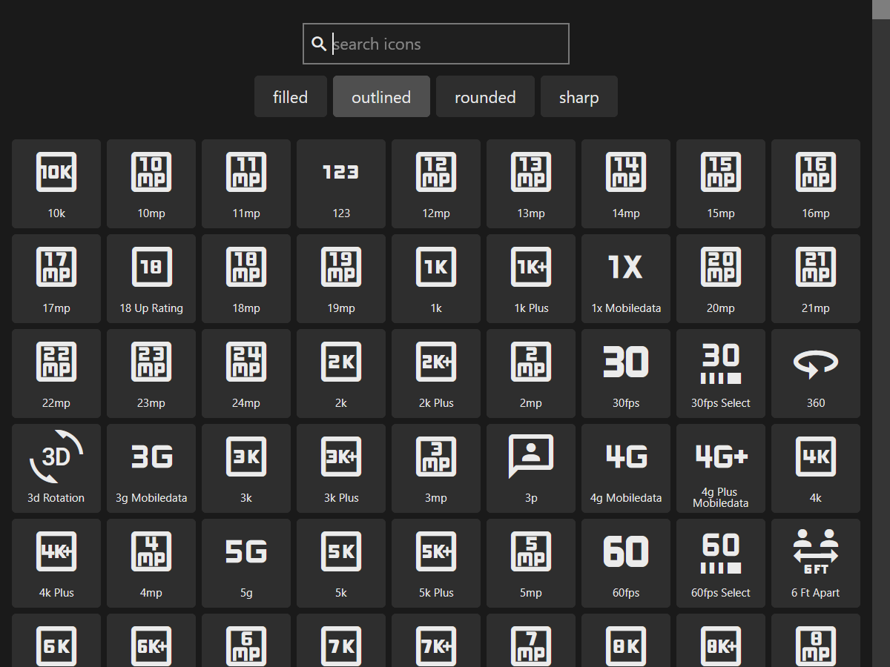

Source: [icon.rs](./icon.rs)

```console
cargo do run icon
```

Search and copy Material Icons constants.

### `image`

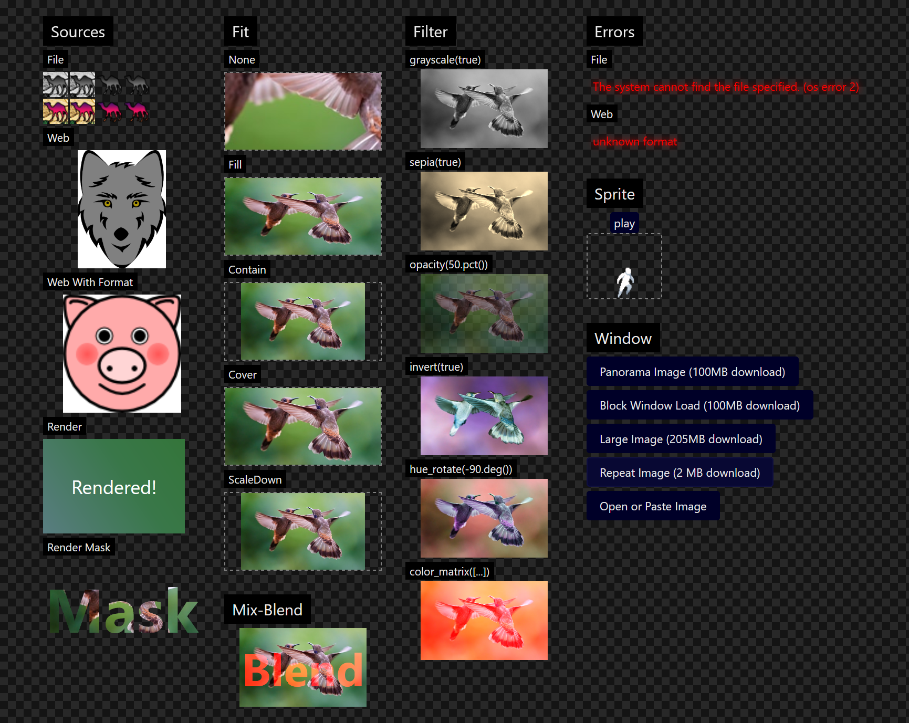

Source: [image.rs](./image.rs)

```console
cargo do run image
```

Demonstrates image loading, displaying, animated sprites, rendering, pasting.

### `layer`

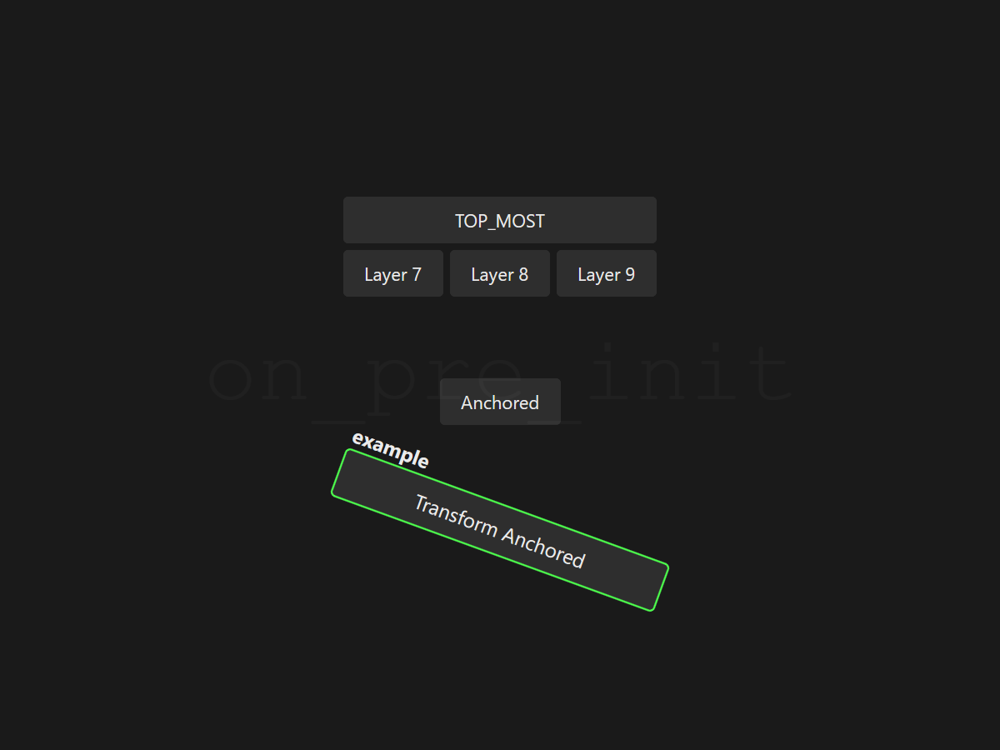

Source: [layer.rs](./layer.rs)

```console
cargo do run layer
```

Demonstrates the LAYERS service.

### `localize`


Source: [localize.rs](./localize.rs)

```console
cargo do run localize
```

Demonstrates localization.

### `markdown`

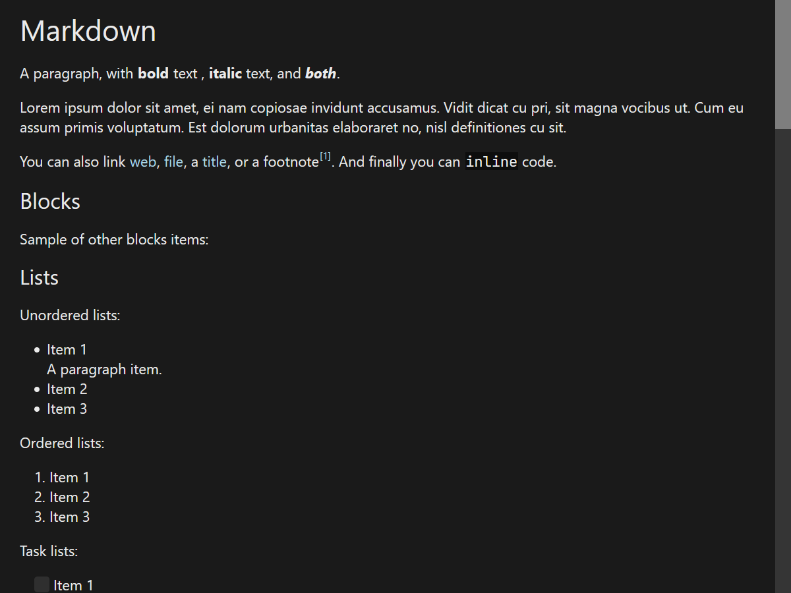

Source: [markdown.rs](./markdown.rs)

```console
cargo do run markdown
```

Demonstrates the `Markdown!` widget.

### `respawn`

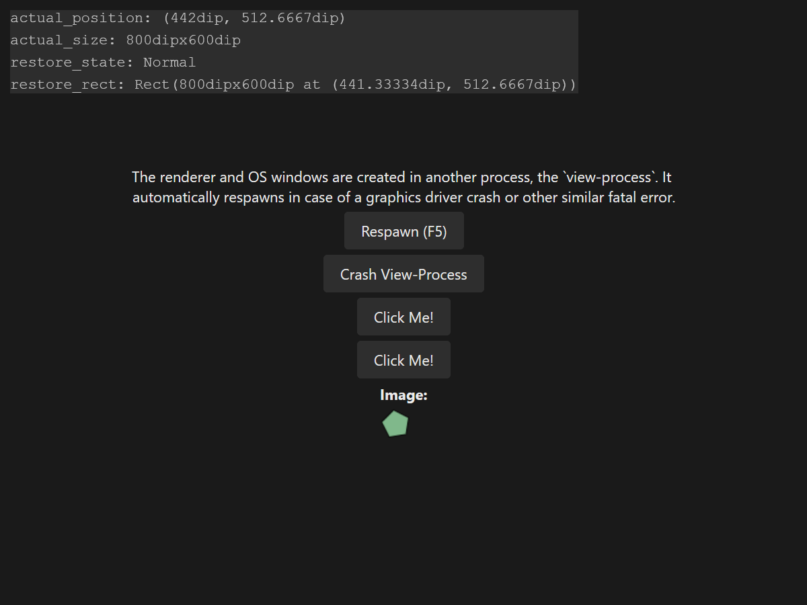

Source: [respawn.rs](./respawn.rs)

```console
cargo do run respawn
```

Demonstrates app-process crash handler and view-process respawn.

### `scroll`


Source: [scroll.rs](./scroll.rs)

```console
cargo do run scroll
```

Demonstrates the `Scroll!` widget and scroll commands.

### `shortcut`

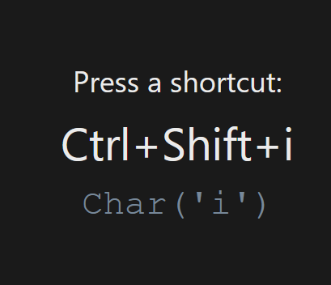

Source: [shortcut.rs](./shortcut.rs)

```console
cargo do run shortcut
```

Small utility that displays the pressed key gestures.

### `text`

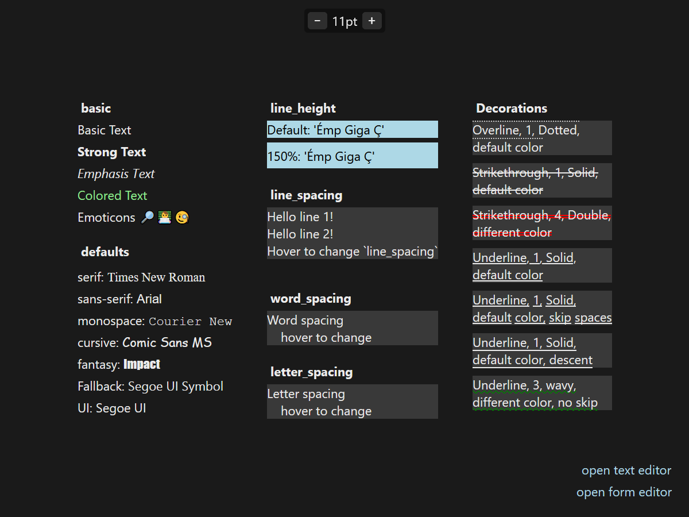

Source: [text.rs](./text.rs)

```console
cargo do run text
```

Demonstrates the `Text!` and `TextInput!` widgets. Text rendering, text editor.

### `transform`

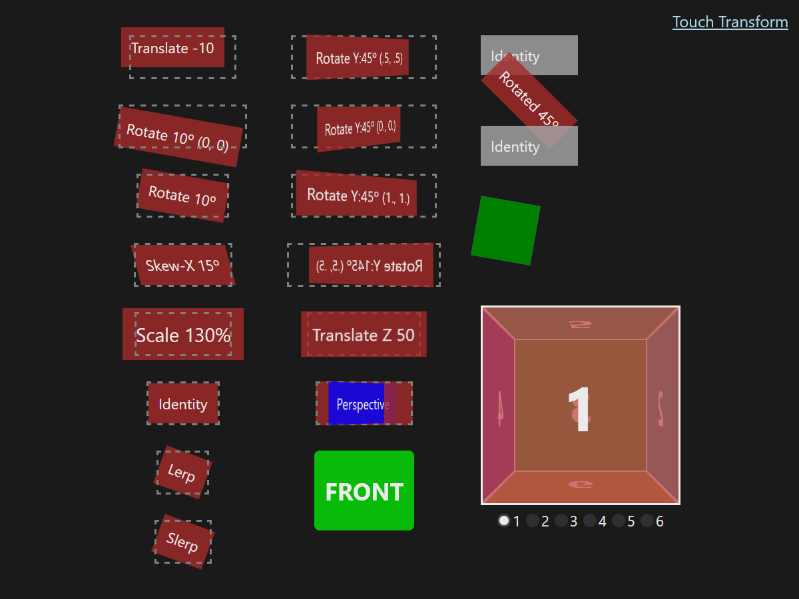

Source: [transform.rs](./transform.rs)

```console
cargo do run transform
```

Demonstrates 2D and 3D transforms, touch transforms.

### `window`


Source: [window.rs](./window.rs)

```console
cargo do run window
```

Demonstrates the window widget, service, state and commands.

<!--do doc --readme #SECTION-END-->

## Adding an Example

Add the new example in `examples/<example-name>.rs`:

```rust
//! Demonstrates foo, bar.

#![cfg_attr(not(debug_assertions), windows_subsystem = "windows")]

use zng::prelude::*;

use zng::view_process::prebuilt as view_process;

fn main() {
    examples_util::print_info();

    zng::env::init!();
    zng::app::crash_handler::init_debug();
    app_main();
}

fn app_main() {
    APP.defaults().run_window(async {
        Window! {
            title = "Foo Example";
            child = Text!("Bar");
        }
    })
}
```

Register it in `examples/Cargo.toml`:

```toml
[[example]]
name = "<example-name>"
path = "<example-name>.rs"
```

Run the example and test it.

```console
cargo do run <example-name>
```

Optionally, take a screenshot and save it to `examples/res/screenshots/<example-name>.png`. You can take a screenshot using
the inspector window, press `Ctrl+Shift+I` then click the "Save Screenshot" menu.

Run [`oxipng`](https://github.com/shssoichiro/oxipng) or another minifier on the screenshot before committing.

```console
oxipng -o max --strip safe --alpha "examples/res/screenshots/<example-name>.png"
```

Update the auto generated README:

```console
cargo do doc --readme-examples
```

Done.

## Local Example

You can create local examples for manual testing in `/examples/examples/<test>.rs`. These
files are git-ignored and can be run using `cargo do run <test>` without needing to register.
