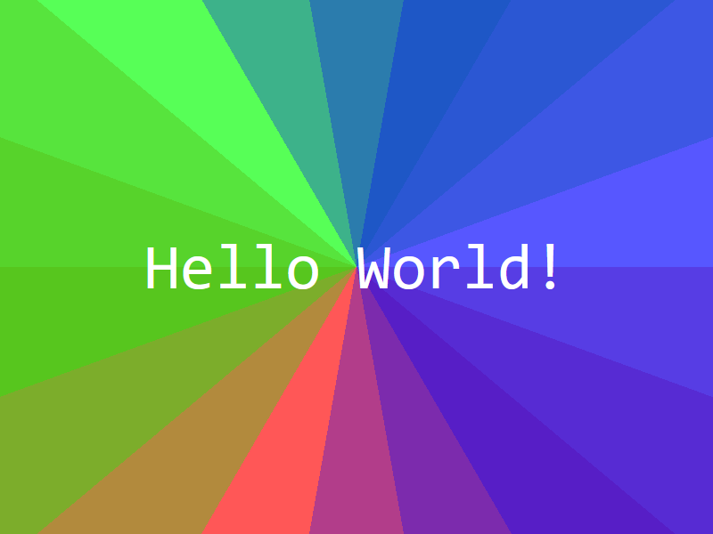
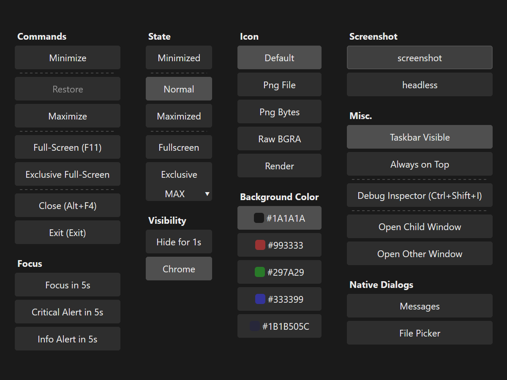

<!--do doc --readme-examples-->
### `animation`

Source: [animation.rs](./animation.rs)

```console
cargo do run animation
```

Demonstrates animation, easing functions.

### `border`

Source: [border.rs](./border.rs)

```console
cargo do run border
```

Demonstrates borders, corner radius, multiple borders per widget and clip-to-bounds.

### `button`

Source: [button.rs](./button.rs)

```console
cargo do run button
```

Demonstrates the button widget.

### `calculator`

Source: [calculator.rs](./calculator.rs)

```console
cargo do run calculator
```

Simple calculator, demonstrates Grid layout, data context.

### `config`

Source: [config.rs](./config.rs)

```console
cargo do run config
```

Demonstrates the CONFIG service, live updating config between processes.

### `countdown`

Source: [countdown.rs](./countdown.rs)

```console
cargo do run countdown
```

Demonstrates the TIMERS service, variable mapping.

### `cursor`

Source: [cursor.rs](./cursor.rs)

```console
cargo do run cursor
```

Demonstrates each `CursorIcon`, tooltip anchored to cursor.

### `extend_view`

Source: [extend_view.rs](./extend_view.rs)

```console
cargo do run extend_view
```

Demonstrates the `zng-view` extension API and render extensions API.

### `focus`

Source: [focus.rs](./focus.rs)

```console
cargo do run focus
```

Demonstrates the focus service, logical and directional navigation.

### `gradient`

Source: [gradient.rs](./gradient.rs)

```console
cargo do run gradient
```

Demonstrates gradient rendering.

### `headless`



Source: [headless.rs](./headless.rs)

```console
cargo do run headless
```

Demonstrates headless apps, image and video rendering.

### `icon`

Source: [icon.rs](./icon.rs)

```console
cargo do run icon
```

Search and copy Material Icons constants.

### `image`

Source: [image.rs](./image.rs)

```console
cargo do run image
```

Demonstrates image loading, displaying, animated sprites, rendering, pasting.

### `layer`

Source: [layer.rs](./layer.rs)

```console
cargo do run layer
```

Demonstrates the LAYERS service.

### `localize`

Source: [localize.rs](./localize.rs)

```console
cargo do run localize
```

Demonstrates localization.

### `markdown`

Source: [markdown.rs](./markdown.rs)

```console
cargo do run markdown
```

Demonstrates the `Markdown!` widget.

### `respawn`

Source: [respawn.rs](./respawn.rs)

```console
cargo do run respawn
```

Demonstrates the view-process respawn error recovery feature.

### `scroll`

Source: [scroll.rs](./scroll.rs)

```console
cargo do run scroll
```

Demonstrates the `Scroll!` widget and scroll commands.

### `shortcuts`

Source: [shortcuts.rs](./shortcuts.rs)

```console
cargo do run shortcuts
```

Small utility that displays the pressed key gestures.

### `text`

Source: [text.rs](./text.rs)

```console
cargo do run text
```

Demonstrates the `Text!` and `TextInput!` widgets. Text rendering, text editor.

### `transform`

Source: [transform.rs](./transform.rs)

```console
cargo do run transform
```

Demonstrates 2D and 3D transforms, touch transforms.

### `window`



Source: [window.rs](./window.rs)

```console
cargo do run window
```

Demonstrates the window widget, service, state and commands.

