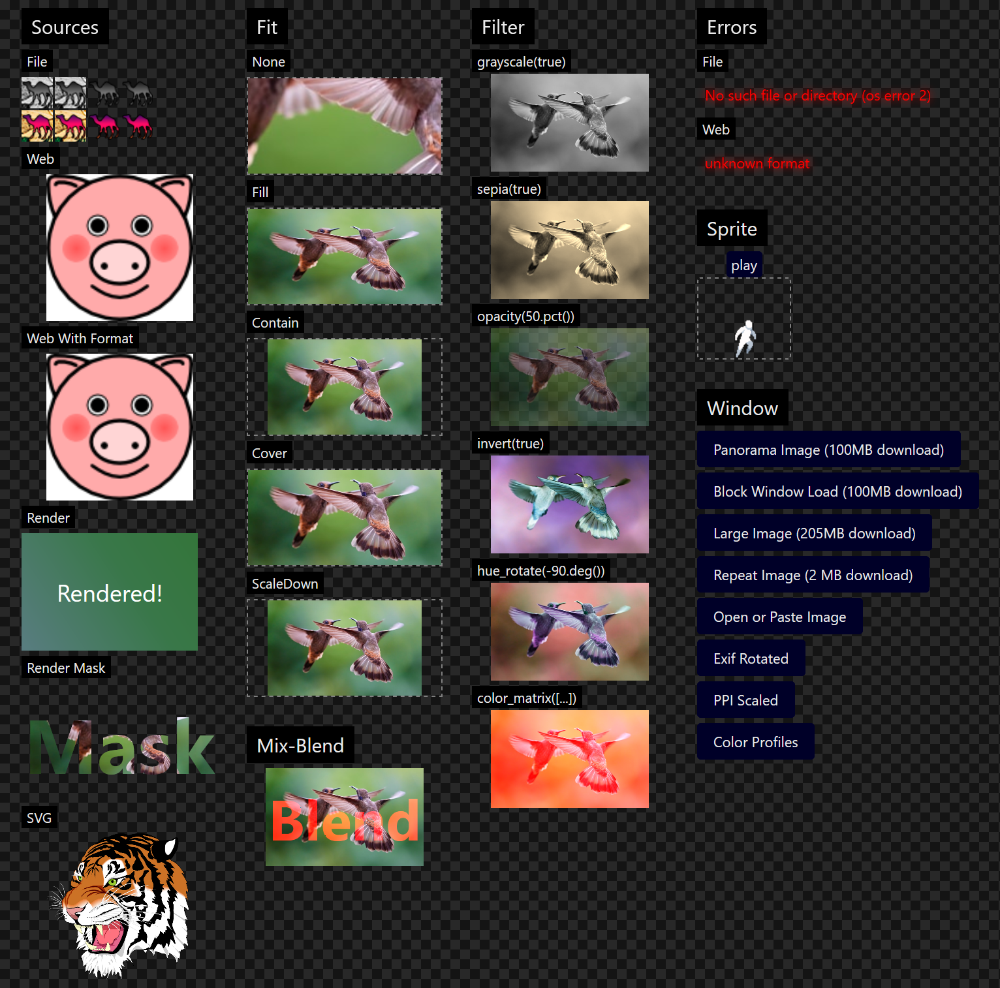

<!--do doc --readme-examples-->
### `animation`


Source: [animation/src](./animation/src)

```console
cargo do run animation
```

Demonstrates animation, easing functions.

### `border`


Source: [border/src](./border/src)

```console
cargo do run border
```

Demonstrates borders, corner radius, multiple borders per widget and clip-to-bounds.

### `button`


Source: [button/src](./button/src)

```console
cargo do run button
```

Demonstrates the button and toggle widgets.

### `calculator`


Source: [calculator/src](./calculator/src)

```console
cargo do run calculator
```

Simple calculator, demonstrates Grid layout, data context.

### `config`


Source: [config/src](./config/src)

```console
cargo do run config
```

Demonstrates the CONFIG service, live updating config between processes.

### `countdown`


Source: [countdown/src](./countdown/src)

```console
cargo do run countdown
```

Demonstrates the TIMERS service, variable mapping.

### `cursor`


Source: [cursor/src](./cursor/src)

```console
cargo do run cursor
```

Demonstrates each `CursorIcon`, tooltip anchored to cursor.

### `extend-view`


Source: [extend-view/src](./extend-view/src)

```console
cargo do run extend-view
```

Demonstrates the `zng-view` extension API and render extensions API.

### `focus`


Source: [focus/src](./focus/src)

```console
cargo do run focus
```

Demonstrates the focus service, logical and directional navigation.

### `gradient`


Source: [gradient/src](./gradient/src)

```console
cargo do run gradient
```

Demonstrates gradient rendering.

### `headless`


Source: [headless/src](./headless/src)

```console
cargo do run headless
```

Demonstrates headless apps, image and video rendering.

### `hot-reload`


Source: [hot-reload/src](./hot-reload/src)

```console
cargo do run hot-reload
```

Demonstrates the `"hot_reload"` feature.

### `icon`


Source: [icon/src](./icon/src)

```console
cargo do run icon
```

Search and copy Material Icons constants.

### `image`



Source: [image/src](./image/src)

```console
cargo do run image
```

Demonstrates image loading, displaying, animated sprites, rendering, pasting.

### `layer`


Source: [layer/src](./layer/src)

```console
cargo do run layer
```

Demonstrates the LAYERS service.

### `localize`


Source: [localize/src](./localize/src)

```console
cargo do run localize
```

Demonstrates localization.

### `markdown`


Source: [markdown/src](./markdown/src)

```console
cargo do run markdown
```

Demonstrates the `Markdown!` widget.

### `respawn`


Source: [respawn/src](./respawn/src)

```console
cargo do run respawn
```

Demonstrates app-process crash handler and view-process respawn.

### `scroll`


Source: [scroll/src](./scroll/src)

```console
cargo do run scroll
```

Demonstrates the `Scroll!` widget and scroll commands.

### `shortcut`


Source: [shortcut/src](./shortcut/src)

```console
cargo do run shortcut
```

Small utility that displays the pressed key gestures.

### `text`


Source: [text/src](./text/src)

```console
cargo do run text
```

Demonstrates the `Text!` and `TextInput!` widgets. Text rendering, text editor.

### `transform`


Source: [transform/src](./transform/src)

```console
cargo do run transform
```

Demonstrates 2D and 3D transforms, touch transforms.

### `window`


Source: [window/src](./window/src)

```console
cargo do run window
```

Demonstrates the window widget, service, state and commands.

<!--do doc --readme #SECTION-END-->

## Adding an Example

Add the new example crate in `examples/<example-name>`:

`examples/<example-name>/Cargo.toml`

```
[package]
name = "<example-name>"
version = "0.0.0"
publish = false
edition = "2021"

[dependencies]
zng = { path = "../../crates/zng", features = ["view_prebuilt"] }
```

`examples/<example-name>/src/main.rs`: 

```rust
//! Demonstrates foo, bar.
use zng::prelude::*;

fn main() {
    examples_util::print_info();
    zng::env::init!();
    zng::app::crash_handler::init_debug();
    app_main();
}

fn app_main() {
    APP.defaults().run_window(async {
        Window! {
            title = "Foo Example";
            child = Text!("Bar");
        }
    })
}
```

Run the example and test it.

```console
cargo do run <example-name>
```

Optionally, take a screenshot and save it to `examples/<example-name>/res/screenshot.png`. You can take a screenshot using
the inspector window, press `Ctrl+Shift+I` then click the "Save Screenshot" menu.

Run [`oxipng`](https://github.com/shssoichiro/oxipng) or another minifier on the screenshot before committing.

```console
oxipng -o max --strip safe --alpha "examples/<example-name>/res/screenshot.png"
```

Update the auto generated README:

```console
cargo do doc --readme-examples
```

Done.

## Local Example

You can create a local "example" for manual testing in `/examples/test/`. This dir is gitignored.