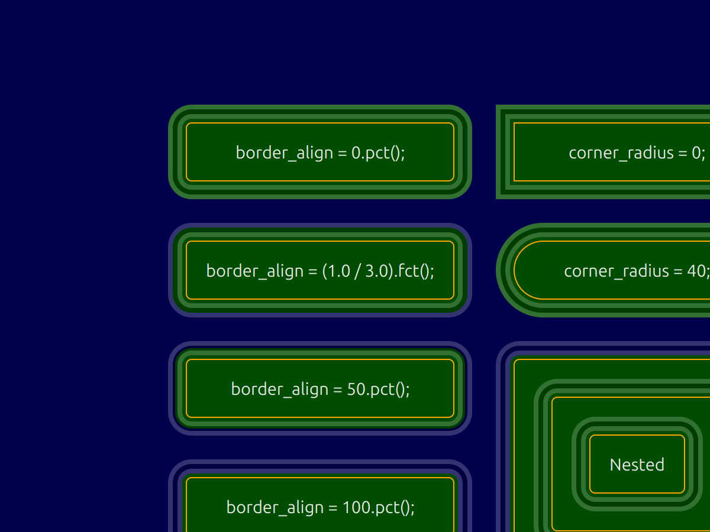
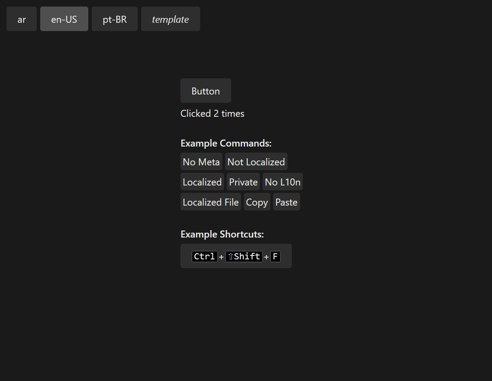
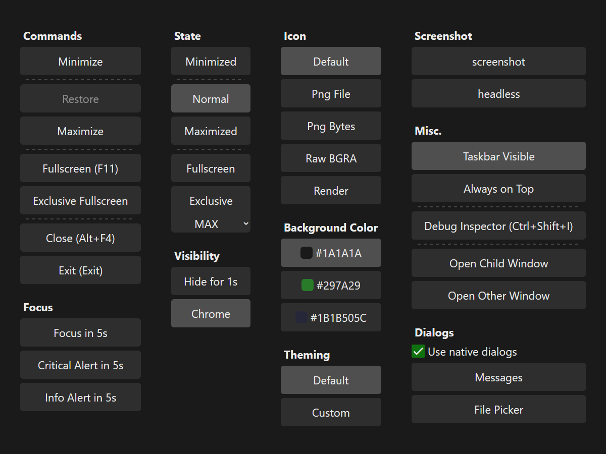

<!--do doc --readme-examples-->
### `animation`


Source: [animation/src](./animation/src)

```console
cargo do run animation
```

Demonstrates animation, easing functions.

### `border`



Source: [border/src](./border/src)

```console
cargo do run border
```

Demonstrates borders, corner radius, multiple borders per widget and clip-to-bounds.

### `button`


Source: [button/src](./button/src)

```console
cargo do run button
```

Demonstrates the button and toggle widgets.

### `calculator`


Source: [calculator/src](./calculator/src)

```console
cargo do run calculator
```

Simple calculator, demonstrates Grid layout, data context.

### `config`


Source: [config/src](./config/src)

```console
cargo do run config
```

Demonstrates the CONFIG and SETTINGS services, live updating config between processes.

### `countdown`


Source: [countdown/src](./countdown/src)

```console
cargo do run countdown
```

Demonstrates the TIMERS service, variable mapping and profiler trace recording.

### `cursor`


Source: [cursor/src](./cursor/src)

```console
cargo do run cursor
```

Demonstrates each `CursorIcon`, tooltip anchored to cursor.

### `extend-view`

Source: [extend-view/src](./extend-view/src)

```console
cargo do run extend-view
```

Demonstrates the `zng-view` extension API and the provided renderer debug and ANGLE extensions.

### `focus`


Source: [focus/src](./focus/src)

```console
cargo do run focus
```

Demonstrates the focus service, logical and directional navigation.

### `gradient`


Source: [gradient/src](./gradient/src)

```console
cargo do run gradient
```

Demonstrates gradient rendering.

### `headless`


Source: [headless/src](./headless/src)

```console
cargo do run headless
```

Demonstrates headless apps, image and video rendering.

### `hot-reload`


Source: [hot-reload/src](./hot-reload/src)

```console
cargo do run hot-reload
```

Demonstrates the `"hot_reload"` feature.

### `icon`


Source: [icon/src](./icon/src)

```console
cargo do run icon
```

Search and copy Material Icons keys.

### `image`


Source: [image/src](./image/src)

```console
cargo do run image
```

Demonstrates image loading, displaying, animated sprites, rendering, pasting.

### `layer`


Source: [layer/src](./layer/src)

```console
cargo do run layer
```

Demonstrates the LAYERS service.

### `localize`



Source: [localize/src](./localize/src)

```console
cargo do run localize
```

Demonstrates localization service and integration.

### `markdown`


Source: [markdown/src](./markdown/src)

```console
cargo do run markdown
```

Demonstrates the `Markdown!` widget.

### `multi`


Source: [multi/src](./multi/src)

```console
cargo do run multi
```

Demonstrates a web, mobile and desktop app setup.

Use `cargo do run multi` to run on the desktop.

Use `cargo do build-apk multi` to build a package and Android Studio "Profile or Debug APK" to run on a device.

Use `cargo do run-wasm multi` to run on the browser.

Use `cargo do build-ios multi` to build library for XCode iOS project.

Note that WASM support is very limited, only a small subset of services are supported and
only headless (without renderer) apps can run. Also note that iOS does not build yet, support is planed after
Glutin implements it (or some other ANGLE based crate).

### `respawn`


Source: [respawn/src](./respawn/src)

```console
cargo do run respawn
```

Demonstrates app-process crash handler and view-process respawn.

### `scroll`


Source: [scroll/src](./scroll/src)

```console
cargo do run scroll
```

Demonstrates the `Scroll!` widget and scroll commands.

### `text`


Source: [text/src](./text/src)

```console
cargo do run text
```

Demonstrates the `Text!` and `TextInput!` widgets. Text rendering, text editor.

### `transform`


Source: [transform/src](./transform/src)

```console
cargo do run transform
```

Demonstrates 2D and 3D transforms, touch transforms.

### `window`



Source: [window/src](./window/src)

```console
cargo do run window
```

Demonstrates the window widget, service, state and commands.

<!--do doc --readme #SECTION-END-->

## Local Example

You can create a local "example" for manual testing in `/examples/test*`. This dir is gitignored.

## Contribute an Example

To add a new example see [`/docs/contribute-example.md`].

[`/docs/contribute-example.md`]: https://github.com/zng-ui/zng/tree/main/docs/contribute-example.md